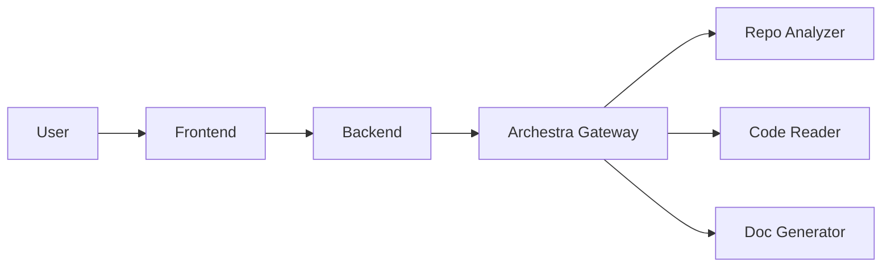

# README Resurrector 🧟‍♂️

> **Bring dead documentation back to life.**
> A multi-agent system that automatically analyzes code and generates comprehensive, beautiful READMEs.


---

### 1. The Engine (Backend + Agents) 🧟‍♂️
Deploy the "All-in-One Engine" to **Hugging Face Spaces**:
- Create a new **Docker Space** on Hugging Face.
- Upload the `Dockerfile.engine` and the `backend` & `mcp-servers` folders.
- Add your `GROQ_API_KEY` and `GITHUB_TOKEN` to the Space Secrets.
- **Why?** HF Spaces gives you 16GB RAM for free, which easily handles multiple agents.

### 2. The Interface (Frontend) 🎨
Deploy to **Vercel**:
- Connect your GitHub repo to Vercel.
- Set the `Root Directory` to `frontend`.
- Add Environment Variable: `NEXT_PUBLIC_API_URL` = `https://your-hf-space-url.hf.space`.

### 3. The Orchestrator (Archestra) 🏎️
- Use **Archestra Cloud** (or host the Archestra image on a second HF Space).
- Connect the agents via the HF Space URL (e.g., `https://your-space.hf.space/sse`).

---

## ✨ Features

- **🔍 Deep Repository Analysis**: Understands project structure, languages, and key entry points.
- **🧠 Context-Aware Reading**: Intelligently selects and chunks code to fit LLM context windows, prioritizing logic over boilerplate.
- **✍️ Generative AI**: Uses **Llama 3 70B** (via Groq) to write human-quality documentation.
- **🛡️ Quality Assurance**: Self-correcting pipeline that validates and improves the README before showing it to you.
- **⚡ Real-time Progress**: Watch the agents work via Server-Sent Events (SSE).

## 🏗️ Architecture

README Resurrector consists of three custom MCP Servers orchestrated by a central backend, all managed by Archestra.



### The Agents (MCP Servers)

1.  **Repo Analyzer** (`mcp-servers/repo-analyzer`): Crawls GitHub trees and identifies "important" files using heuristics.
2.  **Code Reader** (`mcp-servers/code-reader`): Fetches content and performs "Smart Chunking" to optimize token usage.
3.  **Doc Generator** (`mcp-servers/doc-generator`): The creative writer and editor, powered by Llama 3.

## 🚀 Quick Start

### Prerequisites

- Docker & Docker Compose
- [Groq API Key](https://console.groq.com) (Free)
- Archestra Platform (Running locally or cloud)

### Installation

1.  **Clone the repository**
    ```bash
    git clone https://github.com/yourusername/readmere.git
    cd readmere
    ```

2.  **Configure Environment**
    ```bash
    cp .env.example .env
    ```
    Edit `.env` and add your keys:
    - `GROQ_API_KEY`: Your Groq API key.
    - `ARCHESTRA_TOKEN`: Create this in your Archestra dashboard.
    - `ARCHESTRA_PROFILE_ID`: Create a profile in Archestra and assign the 3 agents to it.

3.  **Start Archestra & Services**
    ```bash
    docker compose up --build
    ```

4.  **Register Agents in Archestra**
    - Go to `http://localhost:3000` (Archestra Admin).
    - Add the 3 MCP servers (running in Docker network).
    - Create a Profile and add their tools.
    - **Crucial**: Ensure the Backend uses this Profile ID.

5.  **Resurrect Documentation!**
    - Open `http://localhost:3001`.
    - Paste a GitHub URL (e.g., `https://github.com/facebook/react`).
    - Watch the magic happen.

## 🔧 Archestra Integration Details

We utilize Archestra as the **central nervous system** of the application:

- **Unified Tool Interface**: Our backend doesn't speak "LLM" directly to the agents. It speaks **MCP** through Archestra's Gateway (`/v1/mcp`).
- **Observability**: We use Archestra's dashboard to trace the "thought process" of the documentation generation.
- **Standardization**: All agents follow the official `@modelcontextprotocol/sdk`.

## 🛠️ Tech Stack

- **Frontend**: Next.js 14, Tailwind CSS, Framer Motion (via CSS).
- **Backend**: Express.js, TypeScript, SSE.
- **AI/LLM**: Groq (Llama 3.3 70B Versatile).
- **Orchestration**: Archestra Platform.
- **Protocol**: Model Context Protocol (MCP).

## 📄 License

MIT © 2026 README Resurrector
