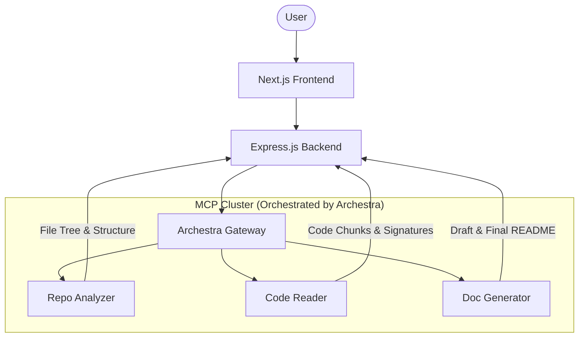

# README Resurrector 🧟‍♂️

> **Bring dead documentation back to life.**
> A multi-agent system that automatically analyzes codebases and generates comprehensive, beautiful READMEs using the Model Context Protocol (MCP) and Archestra.


---

## 📖 Overview

README Resurrector is a production-ready demonstration of how to orchestrate multiple specialized AI agents using **Archestra** and **MCP**. Instead of a single LLM trying to guess what your project does, we use three distinct agents that work in a pipeline to analyze, read, and write documentation.

### Why this exists?
Most AI-generated READMEs are shallow because the LLM lacks context. Our pipeline solves this by:
1.  **Exploring** the entire file tree first.
2.  **Selecting** only the most relevant files.
3.  **Chunking** code intelligently to maximize context window usage.
4.  **Self-Correcting** using a final quality assurance pass.

---

## 📦 Deployment Units

The repository includes specialized folders pre-configured for **Hugging Face Spaces** (Docker SDK):

- **`archestra-platform/`**: A standalone package for deploying the Archestra Admin Panel and MCP Gateway.
  - **Goal**: Provides the "Control Plane" for your agents.
  - **Port**: Exposes `7860` (standard for HF Spaces).
- **`readmere-huggingface-engine/`**: A bundled package containing the Backend Orchestrator and all 3 MCP Servers (Repo Analyzer, Code Reader, Doc Generator).
  - **Goal**: Provides the "Execution Plane".
  - **Internal Orchestration**: Uses PM2 to run multiple processes within a single container.
  - **Port**: Exposes `7860`.

### 🚀 Deploying to Hugging Face

1.  Create two **Docker Spaces** on Hugging Face.
2.  **Space 1 (The Brain)**: Upload the contents of `archestra-platform/`.
3.  **Space 2 (The Engine)**: Upload the contents of `readmere-huggingface-engine/`.
4.  Configure the Secrets (`GROQ_API_KEY`, `GITHUB_TOKEN`, etc.) in Space 2.
5.  Link Space 2's backend to Space 1's gateway using the provided SSE URLs.

---

## 🏗️ Architecture

The system is built on a modular architecture where the "brains" are separated from the "orchestration".



### 1. The Agents (MCP Servers)
Each agent is a standalone MCP server located in `mcp-servers/`:

-   **🔍 Repo Analyzer**: Uses heuristics to find entry points, main logic, and dependency files (e.g., `package.json`, `main.py`).
-   **📖 Code Reader**: Specialized in "Smart Chunking". It reads selected files and extracts function signatures and key logic blocks, ensuring we don't hit LLM token limits while keeping the most important code.
-   **✍️ Doc Generator**: The creative agent. It takes all gathered context and uses **Llama 3 70B** to generate the final Markdown. It also includes a `validate_readme` tool to self-score its work.

### 2. The Orchestrator
The `backend` acts as the project-specific orchestrator. It manages the state machine of the generation process and communicates with the agents through the **Archestra Gateway**.

---

## 🚀 Getting Started (Do It Yourself)

Follow these steps to get your own instance of README Resurrector running.

### 1. Prerequisites
- **Node.js 18+** & **Docker**
- **Groq API Key**: Get it at [console.groq.com](https://console.groq.com).
- **GitHub Token**: A classic Personal Access Token (PAT) with `repo` scope.
- **Archestra Platform**: You can use the local Docker version or Archestra Cloud.

### 2. Environment Setup
Create a `.env` file in the root directory:

```env
GROQ_API_KEY=your_groq_key
GITHUB_TOKEN=your_github_token
ARCHESTRA_URL=http://localhost:3000  # Or your Cloud URL
ARCHESTRA_PROFILE_ID=your_profile_id
```

### 3. Deploying the Agents
You can run agents locally or on a cloud platform like Hugging Face Spaces.

**Local (Docker Compose):**
```bash
docker compose up -d
```
This will start:
-   The 3 MCP Servers.
-   The Express Backend.
-   The Next.js Frontend.

### 4. Configuring Archestra (The "Magic" Step)
To make the agents talk to each other, you must register them in Archestra:

1.  Open your **Archestra Dashboard** at `http://localhost:3000`.
2.  **Register Servers**: Add the 3 MCP servers using their URLs (if running via Docker, use the service names):
    - `Repo Analyzer`: `http://repo-analyzer:3002/sse` (or `http://localhost:3002/sse` if outside Docker)
    - `Code Reader`: `http://code-reader:3003/sse` (or `http://localhost:3003/sse`)
    - `Doc Generator`: `http://doc-generator:3004/sse` (or `http://localhost:3004/sse`)
3.  **Create a Profile**: Create a new Profile named "README-Resurrector".
4.  **Add Tools**: Assign all tools from the 3 registered servers to this profile.
5.  **Copy Profile ID**: Paste this ID into your backend's `.env` file as `ARCHESTRA_PROFILE_ID`.

---

### 🛡️ Single-Port Access (Hugging Face Special)
If you are deploying to Hugging Face using the `readmere-huggingface-engine`, the backend automatically proxies all agents. You only need to expose one URL:

- **Gateway URL**: `https://your-space.hf.space`
- **Repo Analyzer**: `https://your-space.hf.space/mcp/analyzer/sse`
- **Code Reader**: `https://your-space.hf.space/mcp/reader/sse`
- **Doc Generator**: `https://your-space.hf.space/mcp/generator/sse`

This is perfect for HF Spaces which only allows one public port (7860).

---

## 🛠️ Port Reference

| Service | Host Port | Internal Port | Description |
| :--- | :--- | :--- | :--- |
| **Archestra Admin** | 3000 | 3000 | Dashboard for managing agents |
| **Archestra Gateway**| 9000 | 9000 | MCP Proxy Gateway |
| **Frontend** | 3001 | 3000 | Next.js Web Interface |
| **Backend** | 8080 | 8080 | Express.js Orchestrator |
| **Repo Analyzer** | 3002 | 3002 | MCP Agent (Analysis) |
| **Code Reader** | 3003 | 3003 | MCP Agent (Reading) |
| **Doc Generator** | 3004 | 3004 | MCP Agent (Generation) |

---

## 🛠️ Implementation Details

### Smart Chunking (Code Reader)
The `code-reader` doesn't just send raw text. It uses a signature extraction logic:
```typescript
// It identifies exports and main functions to prioritize
const signatures = files.map(f => extractTopLevelSignatures(f.content));
```

### Quality Control (Doc Generator)
The final agent runs a validation loop:
```typescript
const score = await agent.call("validate_readme", { content });
if (score < 80) {
    return await agent.call("enhance_readme", { content, suggestions });
}
```

---

## 🏁 Hackathon Submission Note

This project was built for the **2 Fast 2 MCP Hackathon**. It leverages Archestra to solve the "Context Fragmentation" problem in AI agents by using the Model Context Protocol to bridge the gap between static code and dynamic LLM reasoning.

## 📄 License
MIT © 2026 README Resurrector Team

