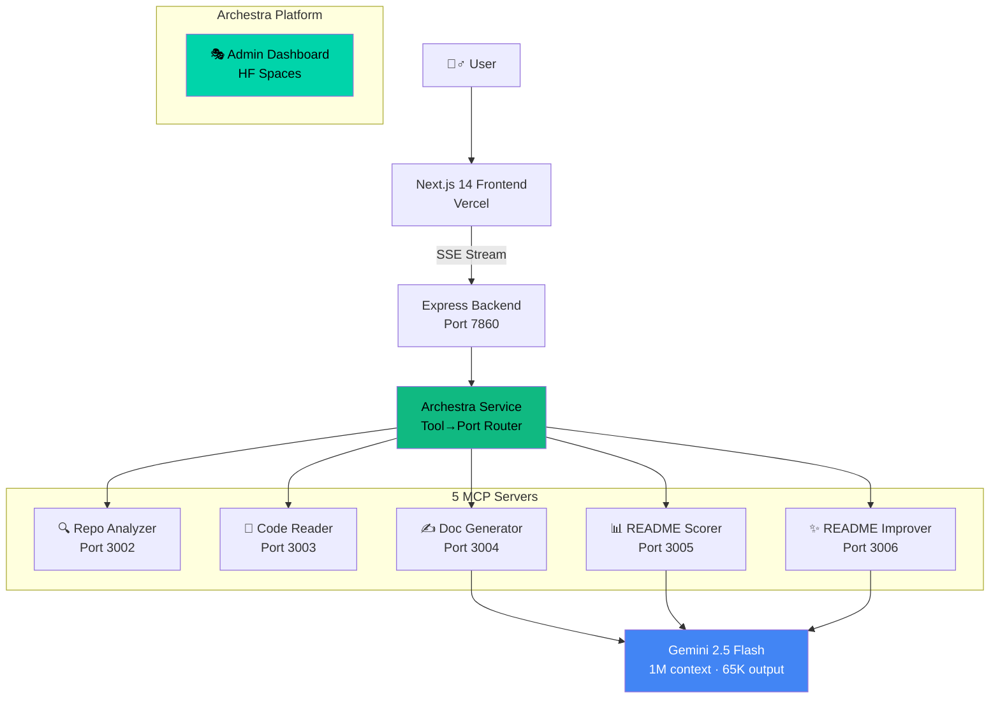

# 🧟‍♂️ README Resurrector

> **Bring dead documentation back to life.** Paste a GitHub URL — five AI agents analyze your repo, read the code, generate a professional README, score it, and improve it — all in seconds.

[](https://readmere.vercel.app)
[](https://archestra.ai)
[](https://aistudio.google.com)
[](https://modelcontextprotocol.io)
[](https://devpost.com)

---

## 📋 Quick Start

> **Want to try it right now?** Follow these 3 steps:

### Option A: Use the Live Demo (Recommended)
1. Go to **[readmere.vercel.app](https://readmere.vercel.app)**
2. Paste any public GitHub repo URL (e.g. `https://github.com/expressjs/express`)
3. Select a style (Minimal / Standard / Detailed), optionally add custom instructions
4. Click **"Resurrect README"** and watch 5 AI agents work in real-time
5. Review the generated README with quality scores, diffs, and improvement options

### Option B: Run Locally with Docker
```bash
# 1. Clone
git clone https://github.com/yadnyeshkolte/readmere.git && cd readmere

# 2. Get free API keys (2 minutes):
#    Gemini: https://aistudio.google.com/apikey (free, 1500 req/day)
#    GitHub: https://github.com/settings/tokens (optional, boosts rate limits)

# 3. Start engine
cd readmere-huggingface-engine
echo "GEMINI_API_KEY=your_key" > .env && echo "GITHUB_TOKEN=your_token" >> .env
docker build -t readmere-engine . && docker run -p 7860:7860 --env-file .env readmere-engine

# 4. Start frontend (new terminal)
cd frontend && npm install
NEXT_PUBLIC_API_URL=http://localhost:7860 npm run dev

# 5. Open http://localhost:3000
```

### Option C: Run Without Docker
```bash
git clone https://github.com/yadnyeshkolte/readmere.git && cd readmere

# Install all services
for dir in mcp-servers/repo-analyzer mcp-servers/code-reader mcp-servers/doc-generator mcp-servers/readme-scorer mcp-servers/readme-improver backend frontend; do
  (cd $dir && npm install)
done

# Set keys
export GEMINI_API_KEY=your_key GITHUB_TOKEN=your_token

# Start 5 MCP servers
PORT=3002 npx tsx mcp-servers/repo-analyzer/src/index.mts &
PORT=3003 npx tsx mcp-servers/code-reader/src/index.mts &
PORT=3004 npx tsx mcp-servers/doc-generator/src/index.mts &
PORT=3005 npx tsx mcp-servers/readme-scorer/src/index.mts &
PORT=3006 npx tsx mcp-servers/readme-improver/src/index.mts &

# Start backend & frontend
cd backend && npm run dev &
cd ../frontend && npm run dev
# Open http://localhost:3000
```

### What to Try
- **Generate READMEs** for repos with bad/missing documentation for the biggest impact
- **Compare styles**: Minimal (~5 sections), Standard (~11), Detailed (~14 sections)
- **Custom instructions**: e.g. "focus on API docs" or "add deployment guide for AWS"
- **Quality scores**: See 5-category breakdown (Completeness, Accuracy, Structure, Readability, Visual)
- **Improve**: Click "✨ Improve Score" to iteratively enhance with custom feedback
- **Diff views**: Compare original vs generated, and before vs after improvement
- **Create PR**: Send the README directly to the repo as a Pull Request
- **Archestra Dashboard**: Visit [yadnyeshkolte-archestra-platform.hf.space](https://yadnyeshkolte-archestra-platform.hf.space) to see MCP agent registration

---

## 🏎️ What is README Resurrector?

README Resurrector is a **multi-agent MCP system** that generates professional README documentation for any GitHub repository. Five specialized AI agents, orchestrated through **Archestra MCP Platform**, each handle one step of the pipeline:

```
GitHub URL → [🔍 Analyzer] → [📖 Reader] → [✍️ Generator] → [📊 Scorer] → [✨ Improver] → README.md
                MCP #1         MCP #2         MCP #3          MCP #4        MCP #5
                  ↑               ↑               ↑               ↑             ↑
                  └──────────── Archestra MCP Platform ────────────────────────┘
```

## 🏗️ Architecture



### The Five MCP Agents

| # | Agent | Port | Purpose | LLM? | Key Tools |
|---|-------|------|---------|------|-----------|
| 1 | 🔍 **Repo Analyzer** | 3002 | GitHub API crawling: file trees, languages, community insights | No | `get_repo_metadata`, `analyze_repository`, `identify_important_files`, `get_repo_insights` |
| 2 | 📖 **Code Reader** | 3003 | File reading, signature extraction, intelligent chunking, command extraction | No | `read_files`, `extract_signatures`, `smart_chunk`, `extract_commands` |
| 3 | ✍️ **Doc Generator** | 3004 | README generation with 3 style presets and custom instructions via Gemini | **Yes** | `generate_readme` |
| 4 | 📊 **README Scorer** | 3005 | 5-category quality evaluation (100-point weighted scale) | **Yes** | `validate_readme` |
| 5 | ✨ **README Improver** | 3006 | Enhancement based on score feedback, preserves existing content | **Yes** | `enhance_readme` |

## ⚡ Tech Stack

| Layer | Technology | Why |
|-------|-----------|-----|
| **AI Model** | [Gemini 2.5 Flash](https://aistudio.google.com) | 1M token context window, 65K token output, fast inference, 1500 free req/day |
| **Protocol** | [MCP](https://modelcontextprotocol.io) | Standardized AI tool interface — any MCP client can call our agents |
| **Orchestration** | [Archestra](https://archestra.ai) | MCP server registration, management, multi-agent orchestration |
| **Frontend** | Next.js 14, TypeScript, Tailwind CSS | SSR, SSE streaming, glassmorphism dark theme |
| **Backend** | Express.js, TypeScript | SSE streaming, MCP client routing, GitHub PR API |
| **Transport** | Streamable HTTP + SSE | Dual MCP transport for modern and legacy clients |
| **Deployment** | HF Spaces (Docker) + Vercel | Free hosting, auto-deploy |

## 🎯 The Pipeline

1. **🔍 Analysis** — Repo Analyzer crawls GitHub API for metadata, file tree, language breakdown, top files, issues, PRs, contributors, releases, and community health
2. **📖 Code Reading** — Code Reader fetches important files (up to 30K chars each), extracts function/class signatures, verified install/run/test commands, and creates LLM-optimized chunks (30K token budget)
3. **✍️ Generation** — Doc Generator sends enriched context to Gemini 2.5 Flash with style-specific system prompts (up to 32K output tokens for detailed mode)
4. **📊 Scoring** — README Scorer independently evaluates quality across 5 weighted categories, returns structured JSON
5. **✨ Improvement** — If score < 80, README Improver enhances based on specific suggestions (up to 16K output tokens)

### Quality Scoring System

| Category | Weight | What It Measures |
|----------|--------|-----------------|
| **Completeness** | 30% | All essential sections present |
| **Accuracy** | 25% | Code examples and commands are correct |
| **Structure** | 20% | Proper markdown, logical order |
| **Readability** | 15% | Clear language, appropriate detail |
| **Visual Appeal** | 10% | Badges, emoji, tables, code blocks |

## 🎭 Archestra Platform

The **[Archestra MCP Platform](https://yadnyeshkolte-archestra-platform.hf.space)** provides:
- **MCP Server Registry** — All 5 agents are registered and discoverable
- **Admin Dashboard** — View agent endpoints, health, and configuration
- **Chat UI** — Interact with registered MCP agents through Archestra's built-in chat
- **Centralized Runtime** — Coordinates the multi-agent pipeline

> Visit the live dashboard: [yadnyeshkolte-archestra-platform.hf.space](https://yadnyeshkolte-archestra-platform.hf.space)

## ✨ Key Features

- **5 Specialized MCP Agents** with single-responsibility design
- **3 Output Styles** — Minimal, Standard, Detailed
- **Custom Instructions** — Guide the AI on what to focus on
- **100-Point Quality Scoring** — 5 weighted categories
- **Iterative Improvement** — Enhance with custom feedback
- **Diff Views** — Original vs generated, before vs after improvement
- **One-Click PR** — Push README to GitHub as a Pull Request
- **Real-Time SSE Progress** — Watch each agent work
- **Verified Commands** — Extracted from actual config files
- **Community Insights** — Issues, PRs, contributors, releases
- **Fallback Mode** — Basic README if LLM fails
- **Session Persistence** — Navigate away without losing state
- **GitHub Dark Mode Preview** — Pixel-perfect README rendering

## 📁 Project Structure

```
readmere/
├── frontend/                    # Next.js 14 — Vercel
│   └── src/
│       ├── app/                 # Pages: home, generate, score
│       └── components/          # URLInput, ProgressTracker, ReadmePreview, DiffView
├── backend/                     # Express.js — orchestration
│   └── src/
│       ├── agents/orchestrator.ts   # Pipeline controller
│       ├── services/archestra.ts    # MCP client router
│       └── routes/generate.ts       # SSE + improve + PR endpoints
├── mcp-servers/                 # 5 standalone MCP servers
│   ├── repo-analyzer/           # #1: GitHub API (no LLM)
│   ├── code-reader/             # #2: File I/O (no LLM)
│   ├── doc-generator/           # #3: Gemini README generation
│   ├── readme-scorer/           # #4: Gemini quality scoring
│   └── readme-improver/         # #5: Gemini enhancement
├── readmere-huggingface-engine/ # 🐳 Docker image for HF Spaces
├── archestra-platform/          # Archestra HF Space config
├── ARCHITECTURE.md              # Deep technical docs
├── DEPLOYMENT.md                # Deployment guide
└── docker-compose.yml           # Local full-stack orchestration
```
---

<p align="center">
  <b>🧟‍♂️ Stop writing READMEs from scratch. Let the dead docs rise again.</b>
  <br/>
  Built with ❤️ by <a href="https://github.com/yadnyeshkolte">Yadnyesh Kolte</a> 
</p>
