# 🧟‍♂️ README Resurrector

> **Bring dead documentation back to life.** Paste a GitHub URL — three AI agents analyze your repo, read the code, and generate professional README files in seconds.

[](https://archestra.ai)
[](https://groq.com)
[](https://modelcontextprotocol.io)
[](https://devpost.com)

---

## 🏎️ What is README Resurrector?

README Resurrector is a **multi-agent MCP system** that automatically generates comprehensive, professional-grade README documentation for any GitHub repository. Instead of one monolithic AI, it uses three specialized AI agents orchestrated through the **Archestra MCP Platform**:

```
GitHub URL → [Repo Analyzer] → [Code Reader] → [Doc Generator] → README.md ✨
                  MCP #1            MCP #2           MCP #3
                    ↑                  ↑                ↑
                    └──────── Archestra Platform ────────┘
```

## 🏗️ Architecture

```mermaid
graph TB
    User[🧟‍♂️ User] --> Frontend[Next.js Frontend]
    Frontend --> Backend[Express Backend]
    Backend --> Archestra[Archestra Platform]
    
    subgraph "MCP Servers"
        RA[🔍 Repo Analyzer<br/>Port 3002]
        CR[📖 Code Reader<br/>Port 3003]
        DG[✍️ Doc Generator<br/>Port 3004]
    end
    
    Archestra --> RA
    Archestra --> CR
    Archestra --> DG
    
    DG --> Groq[Llama 3 70B<br/>via Groq]
    
    style Archestra fill:#10b981,color:#000
    style Groq fill:#f97316,color:#000
```



### The Three Agents

| Agent | MCP Server | Purpose | Key Tools |
|-------|-----------|---------|-----------|
| 🔍 **Repo Analyzer** | `repo-analyzer` | Crawls GitHub repos via API, maps file trees, identifies tech stack | `analyze_repository`, `get_repo_metadata`, `identify_important_files` |
| 📖 **Code Reader** | `code-reader` | Reads files, extracts function signatures, intelligently chunks code | `read_files`, `extract_signatures`, `smart_chunk` |
| ✍️ **Doc Generator** | `doc-generator` | Generates, validates, and enhances README using Llama 3 70B | `generate_readme`, `validate_readme`, `enhance_readme` |

## ⚡ Tech Stack

- **Frontend**: Next.js 14, TypeScript, TailwindCSS
- **Backend**: Express.js, TypeScript, SSE streaming
- **AI Model**: Llama 3 70B via [Groq](https://groq.com) (blazing fast inference)
- **Protocol**: [Model Context Protocol (MCP)](https://modelcontextprotocol.io)
- **Orchestration**: [Archestra Platform](https://archestra.ai)
- **Transport**: Streamable HTTP + SSE (dual-transport support)
- **Deployment**: Hugging Face Spaces (Docker) + Vercel

## 🚀 Quick Start

### Prerequisites
- Node.js 20+
- GitHub Personal Access Token
- Groq API Key

### Local Development

```bash
# Clone
git clone https://github.com/yadnyeshkolte/readmere.git
cd readmere

# Install dependencies (all services)
cd mcp-servers/repo-analyzer && npm install && cd ../..
cd mcp-servers/code-reader && npm install && cd ../..
cd mcp-servers/doc-generator && npm install && cd ../..
cd backend && npm install && cd ..
cd frontend && npm install && cd ..

# Set environment variables
cp .env.example .env
# Edit .env with your GROQ_API_KEY and GITHUB_TOKEN

# Start MCP servers
PORT=3002 npx tsx mcp-servers/repo-analyzer/src/index.mts &
PORT=3003 npx tsx mcp-servers/code-reader/src/index.mts &
PORT=3004 npx tsx mcp-servers/doc-generator/src/index.mts &

# Start backend
cd backend && npm run dev &

# Start frontend
cd frontend && npm run dev
```

### Docker (Recommended)

```bash
docker-compose up --build
```

This starts all services including the Archestra platform.

## 🎯 How It Works

1. **User pastes a GitHub URL** into the frontend
2. **Backend orchestrator** connects to MCP servers (via Archestra or direct)
3. **Agent 1 (Repo Analyzer)** crawls the GitHub API:
   - Fetches repo metadata (stars, language, description)
   - Maps the complete file tree
   - Identifies the most important files to read
4. **Agent 2 (Code Reader)** processes the code:
   - Reads identified files from GitHub
   - Extracts function/class signatures
   - Intelligently chunks code to fit LLM context
5. **Agent 3 (Doc Generator)** creates documentation:
   - Sends structured context to Llama 3 70B via Groq
   - Generates a comprehensive README
   - Validates quality (scores out of 100)
   - Auto-enhances if score < 80
6. **Real-time progress** streamed to frontend via SSE

## 🔌 Archestra Integration

README Resurrector leverages Archestra as its MCP orchestration layer:

- **MCP Server Registry**: All 3 agents registered as MCP servers in Archestra
- **Dual Transport**: Supports both Streamable HTTP (`/mcp`) and legacy SSE (`/sse`)
- **Agent Chat UI**: Interact with the README agent via Archestra's ChatGPT-style interface
- **Observability**: Monitor agent performance and tool calls through Archestra dashboard
- **Security**: Archestra's built-in guardrails protect against prompt injection

## 📁 Project Structure

```
readmere/
├── frontend/                    # Next.js 14 frontend
│   ├── src/app/                # Pages (landing, generate)
│   └── src/components/         # UI components
├── backend/                    # Express.js API server
│   ├── src/agents/            # Orchestrator logic
│   └── src/services/          # Archestra service
├── mcp-servers/
│   ├── repo-analyzer/         # MCP Server #1
│   ├── code-reader/           # MCP Server #2
│   └── doc-generator/         # MCP Server #3
├── readmere-huggingface-engine/ # HF Space deployment
├── archestra-platform/         # Archestra HF Space config
└── docker-compose.yml          # Full stack orchestration
```

## 🏁 Hackathon: 2 Fast 2 MCP

This project was built for the **[2 Fast 2 MCP Hackathon](https://devpost.com)** organized by Archestra.

### Why README Resurrector?

Every developer knows the pain: you find a promising open-source repo, but the README is outdated, incomplete, or missing entirely. README Resurrector solves this by:

- **Automatically analyzing** any GitHub repository
- **Understanding the code** through intelligent parsing
- **Generating professional docs** in seconds, not hours
- **Validating quality** with an automated scoring system

### Archestra Features Used

- ✅ MCP Server Registration & Management
- ✅ Multi-agent orchestration
- ✅ Streamable HTTP transport
- ✅ Built-in Chat UI for agent interaction
- ✅ Centralized runtime
- ✅ Platform observability

---

<p align="center">
  <b>🧟‍♂️ Stop writing READMEs from scratch. Let the dead docs rise again.</b>
</p>

<p align="center">
  Built with ❤️ for the 2 Fast 2 MCP Hackathon
</p>
