# 🧟‍♂️ README Resurrector

> **Bring dead documentation back to life.** Paste a GitHub URL — five AI agents analyze your repo, read the code, generate a professional README, score it, and improve it — all in seconds.

[](https://archestra.ai)
[](https://aistudio.google.com)
[](https://modelcontextprotocol.io)
[](https://devpost.com)

---

## 🏎️ What is README Resurrector?

README Resurrector is a **multi-agent MCP system** that automatically generates comprehensive, professional-grade README documentation for any GitHub repository. Instead of one monolithic AI, it uses **five specialized AI agents** orchestrated through the **Archestra MCP Platform**:

```
GitHub URL → [Repo Analyzer] → [Code Reader] → [Doc Generator] → [Scorer] → [Improver] → README.md ✨
                 MCP #1           MCP #2           MCP #3          MCP #4      MCP #5
                   ↑                ↑                ↑               ↑           ↑
                   └──────────────── Archestra Platform ────────────────────────┘
```

Every developer knows the pain: you find a promising open-source repo, but the README is outdated, incomplete, or missing entirely. README Resurrector solves this by **automatically analyzing** the code, **understanding the architecture**, and **generating polished documentation** — complete with quality scoring and iterative improvement.

## 🏗️ Architecture

```mermaid
graph TB
    User[🧟‍♂️ User] --> Frontend[Next.js Frontend]
    Frontend --> Backend[Express Backend<br/>Port 7860]
    Backend --> Archestra[Archestra Service]
    
    subgraph "MCP Servers"
        RA[🔍 Repo Analyzer<br/>Port 3002]
        CR[📖 Code Reader<br/>Port 3003]
        DG[✍️ Doc Generator<br/>Port 3004]
        RS[📊 README Scorer<br/>Port 3005]
        RI[✨ README Improver<br/>Port 3006]
    end
    
    Archestra --> RA
    Archestra --> CR
    Archestra --> DG
    Archestra --> RS
    Archestra --> RI
    
    DG --> Gemini[Gemini 2.5 Flash<br/>via Google AI]
    RS --> Gemini
    RI --> Gemini
    
    style Archestra fill:#10b981,color:#000
    style Gemini fill:#4285F4,color:#fff
```



### The Five Agents

| Agent | MCP Server | Port | Purpose | Key Tools |
|-------|-----------|------|---------|-----------|
| 🔍 **Repo Analyzer** | `repo-analyzer` | 3002 | Crawls GitHub repos via API, maps file trees, identifies tech stack | `analyze_repository`, `get_repo_metadata`, `identify_important_files` |
| 📖 **Code Reader** | `code-reader` | 3003 | Reads files, extracts function signatures, intelligently chunks code for LLM context | `read_files`, `extract_signatures`, `smart_chunk` |
| ✍️ **Doc Generator** | `doc-generator` | 3004 | Generates comprehensive README using Gemini 2.5 Flash with custom instructions support | `generate_readme` |
| 📊 **README Scorer** | `readme-scorer` | 3005 | Validates README quality across 5 weighted categories (100-point scale) | `validate_readme` |
| ✨ **README Improver** | `readme-improver` | 3006 | Enhances README based on scoring suggestions, preserving existing content | `enhance_readme` |

## ⚡ Tech Stack

| Layer | Technology |
|-------|-----------|
| **Frontend** | Next.js 14, TypeScript, CSS (dark theme, glassmorphism) |
| **Backend** | Express.js, TypeScript, Server-Sent Events (SSE) |
| **AI Model** | Gemini 2.5 Flash via [Google AI Studio](https://aistudio.google.com) (fast, generous free tier) |
| **Protocol** | [Model Context Protocol (MCP)](https://modelcontextprotocol.io) |
| **Orchestration** | [Archestra Platform](https://archestra.ai) |
| **Transport** | Streamable HTTP + SSE (dual-transport support) |
| **Deployment** | Hugging Face Spaces (Docker) + Vercel |

## 🎯 How It Works (Step by Step)


### The Quality Scoring System

READMEs are scored across **5 weighted categories**:

| Category | Weight | What It Measures |
|----------|--------|-----------------|
| **Completeness** | 30% | All essential sections present (title, description, install, usage, features, contributing, license) |
| **Accuracy** | 25% | Code examples work, correct tech stack, accurate commands |
| **Structure** | 20% | Proper markdown, logical section order, heading hierarchy |
| **Readability** | 15% | Clear language, good flow, appropriate detail level |
| **Visual Appeal** | 10% | Badges, emoji, tables, syntax-highlighted code blocks |

Users can click **"✨ Improve Score"** to re-enhance the README based on the specific suggestions. Visit `/score` in the app for the full methodology.

## 🚀 Quick Start

### Prerequisites
- Node.js 20+
- GitHub Personal Access Token ([create one](https://github.com/settings/tokens))
- Gemini API Key ([get one free](https://aistudio.google.com/apikey))

### Local Development

```bash
# Clone
git clone https://github.com/yadnyeshkolte/readmere.git
cd readmere

# Install dependencies for all services
cd mcp-servers/repo-analyzer && npm install && cd ../..
cd mcp-servers/code-reader && npm install && cd ../..
cd mcp-servers/doc-generator && npm install && cd ../..
cd mcp-servers/readme-scorer && npm install && cd ../..
cd mcp-servers/readme-improver && npm install && cd ../..
cd backend && npm install && cd ..
cd frontend && npm install && cd ..

# Set environment variables
cp .env.example .env
# Edit .env with your GEMINI_API_KEY and GITHUB_TOKEN

# Start all 5 MCP servers
PORT=3002 GITHUB_TOKEN=$GITHUB_TOKEN npx tsx mcp-servers/repo-analyzer/src/index.mts &
PORT=3003 GITHUB_TOKEN=$GITHUB_TOKEN npx tsx mcp-servers/code-reader/src/index.mts &
PORT=3004 GEMINI_API_KEY=$GEMINI_API_KEY npx tsx mcp-servers/doc-generator/src/index.mts &
PORT=3005 GEMINI_API_KEY=$GEMINI_API_KEY npx tsx mcp-servers/readme-scorer/src/index.mts &
PORT=3006 GEMINI_API_KEY=$GEMINI_API_KEY npx tsx mcp-servers/readme-improver/src/index.mts &

# Start backend
cd backend && npm run dev &

# Start frontend
cd frontend && npm run dev
```

### Docker (Recommended)

```bash
docker-compose up --build
```

This starts all 5 MCP servers, the backend, and the Archestra platform.

## 📁 Project Structure

```
readmere/
├── frontend/                        # Next.js 14 frontend
│   ├── src/app/
│   │   ├── page.tsx                # Landing page
│   │   ├── generate/page.tsx       # Generation page (SSE progress, preview, quality)
│   │   ├── score/page.tsx          # Score methodology page
│   │   └── layout.tsx              # Root layout (favicon, fonts)
│   └── src/components/
│       ├── URLInput.tsx            # URL input + custom instructions
│       ├── ProgressTracker.tsx     # 4-step progress UI
│       ├── ReadmePreview.tsx       # Markdown preview + copy/download
│       ├── Header.tsx              # Navigation
│       └── Footer.tsx              # Footer
│
├── readmere-huggingface-engine/     # 🐳 HF Space deployment (everything below)
│   ├── Dockerfile                  # Builds & starts all 5 MCP servers + backend
│   ├── backend/
│   │   └── src/
│   │       ├── index.ts            # Express server
│   │       ├── routes/generate.ts  # /api/generate + /api/generate/improve
│   │       ├── agents/orchestrator.ts  # Pipeline orchestration
│   │       ├── services/archestra.ts   # MCP client (tool→port routing)
│   │       └── utils/json.ts       # Safe JSON parser
│   └── mcp-servers/
│       ├── repo-analyzer/          # MCP #1: GitHub repo analysis
│       ├── code-reader/            # MCP #2: File reading & chunking
│       ├── doc-generator/          # MCP #3: README generation (LLM)
│       ├── readme-scorer/          # MCP #4: Quality scoring (LLM)
│       └── readme-improver/        # MCP #5: Enhancement (LLM)
│
├── backend/                        # Mirror of readmere-huggingface-engine/backend
├── mcp-servers/                    # Mirror of readmere-huggingface-engine/mcp-servers
├── archestra-platform/             # Archestra HF Space config
├── PROGRESS.md                     # Project state (AI agent context)
├── ARCHITECTURE.md                 # Deep technical documentation
├── DEPLOYMENT.md                   # Deployment guide
└── docker-compose.yml              # Full stack orchestration
```

## 🔌 MCP Transport & Archestra Integration

Each MCP server supports **dual transport**:

- **Streamable HTTP** (`POST /mcp`) — Modern, session-based, preferred
- **SSE** (`GET /sse` + `POST /messages`) — Legacy fallback

The **Archestra Service** (`backend/src/services/archestra.ts`) manages connections:
- Maintains a `tool→port` routing map
- Caches MCP client connections per port
- Auto-retries with fresh connections on failure
- Supports both Streamable HTTP and SSE transports

### Archestra Platform Features Used
- ✅ MCP Server Registration & Management
- ✅ Multi-agent orchestration (5 agents)
- ✅ Streamable HTTP transport
- ✅ Built-in Chat UI for agent interaction
- ✅ Centralized runtime
- ✅ Platform observability

## 🧪 API Endpoints

### `POST /api/generate`
Generates a README for a GitHub repository.

**Request**:
```json
{
  "repoUrl": "https://github.com/owner/repo",
  "userPrompt": "Focus on API documentation, add deployment guide"
}
```

**Response**: Server-Sent Events stream with `progress` and `result` events.

### `POST /api/generate/improve`
Improves an existing README based on suggestions.

**Request**:
```json
{
  "readme": "# Existing README content...",
  "suggestions": "Add installation steps, include badges, fix code examples"
}
```

**Response**:
```json
{
  "readme": "# Improved README...",
  "quality": { "score": 92, "categories": {...}, "suggestions": [...] }
}
```

## 🏁 Hackathon: 2 Fast 2 MCP

This project was built for the **[2 Fast 2 MCP Hackathon](https://devpost.com)** organized by Archestra.

### Why 5 MCP Servers?

Instead of one monolithic agent doing everything, we split responsibilities into **purpose-built specialists**:

1. **Repo Analyzer** focuses solely on GitHub API interaction — no LLM needed
2. **Code Reader** handles file I/O and intelligent chunking — no LLM needed
3. **Doc Generator** is the creative writer — uses Gemini 2.5 Flash
4. **README Scorer** is the quality checker — independent LLM evaluation
5. **README Improver** acts on feedback — targeted LLM enhancement

This separation means each agent can be **tested, scaled, and improved independently**. It also prevents context contamination — the scorer doesn't know what instructions were given to the generator.

---

<p align="center">
  <b>🧟‍♂️ Stop writing READMEs from scratch. Let the dead docs rise again.</b>
</p>

<p align="center">
  Built with ❤️ for the 2 Fast 2 MCP Hackathon
</p>
