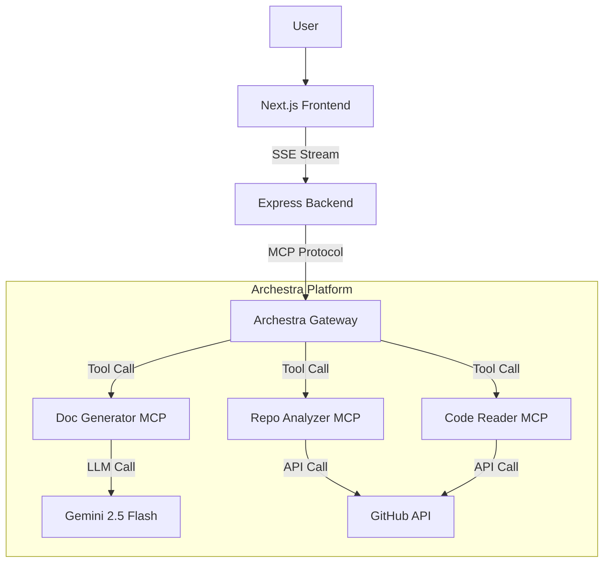

# Architecture: README Resurrector

## Overview

README Resurrector is a multi-agent system designed to automatically generate high-quality documentation for software repositories. It leverages the **Archestra MCP Platform** to orchestrate specialized agents that analyze, read, and document code.

## System Components

### 1. Frontend (Next.js 14)
- **Role**: User interface for input and real-time visualization.
- **Key Features**:
  - SSE (Server-Sent Events) listener for progress updates.
  - Markdown rendering with syntax highlighting.
  - Interactive quality report.

### 2. Backend (Express + TypeScript)
- **Role**: Orchestrator and API Gateway.
- **Key Components**:
  - **Orchestrator**: Defines the workflow logic (Analysis -> Reading -> Generation -> QA).
  - **ArchestraService**: A custom client wrapper around `@modelcontextprotocol/sdk` that handles the connection to the Archestra Platform.
  - **Routes**: Handles the `/api/generate` endpoint.

### 3. MCP Servers (The Agents)

These are standalone microservices running as Docker containers, registered with Archestra.

#### Agent 1: Repo Analyzer (`repo-analyzer`)
- **Tools**: `analyze_repository`, `identify_important_files`.
- **Logic**: Fetches the Git tree, calculates language statistics, and uses heuristics to rank files by importance (e.g., `package.json` > `src/index.ts` > `tests/`).

#### Agent 2: Code Reader (`code-reader`)
- **Tools**: `read_files`, `extract_signatures`, `smart_chunk`.
- **Logic**: 
  - Fetches raw content.
  - Extracts signatures (function definitions) to provide context without consuming full token limits.
  - "Smart Chunking": Fits the most important code into the context window (approx 15k tokens).

#### Agent 3: Doc Generator (`doc-generator`)
- **Tools**: `generate_readme`, `validate_readme`, `enhance_readme`.
- **Logic**:
  - Uses **Gemini 2.5 Flash** for high-speed, high-quality generation.
  - Performs a self-correction loop if the generated README quality score is low.

## Archestra Integration

This project demonstrates the power of Archestra as a central orchestration platform:

1.  **Unified Gateway**: The backend talks to a single endpoint (`/v1/mcp/{profileId}`). It doesn't need to know where the individual agents are running.
2.  **Observability**: Every step of the documentation process is logged in Archestra, allowing for deep debugging and performance analysis.
3.  **Security**: Archestra acts as a firewall for LLM interactions.

## Data Flow

1.  User submits `https://github.com/owner/repo`.
2.  Backend calls `analyze_repository` via Archestra.
3.  Agent 1 returns the file tree.
4.  Backend calls `identify_important_files`.
5.  Backend calls `read_files` for the top 20 files.
6.  Backend calls `smart_chunk` to prepare the prompt.
7.  Backend calls `generate_readme` with metadata + chunks.
8.  Agent 3 calls Gemini and returns Markdown.
9.  Backend streams the result to Frontend.
